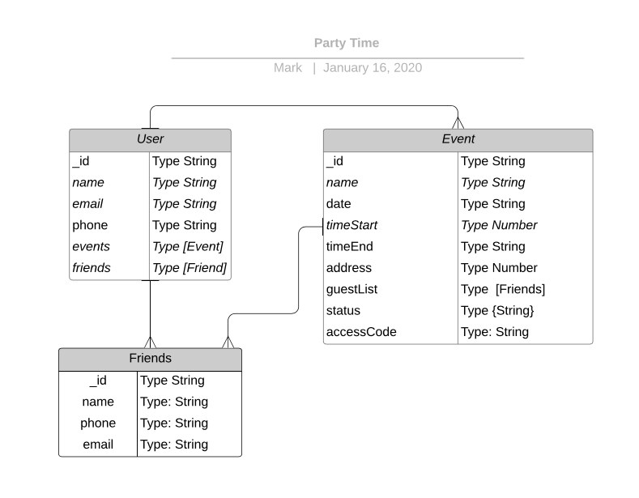

# Party Time App

 
## Purpose

The purpose of the app is to be able to add events create friends to invite to the events 

## User Stories

    AAU,  I would like to sign up if I don’t have a login for the application

    AAU, I would like to login to the application

    AAU, when I log in I would like to go to the home page

    AAU, I would like to Add, Search, Remove and Update Friends

    AAU, I would like to create, search, remove and update events

## Planin

    [Trello](https://trello.com/b/z20R33jd/unit-4-project)

## Wireframes

- App

 

## ERD

## Technologies Used

    - React
    - HTML/CSS/JS
    - Node/Express
    - MongoDB
    - JSON Web Tokens

## Future Enhancements

    Add google maps API to display the event address

    Add twilio API to sent text messages

    AAU, I would like to Add, and remove guest from the event
